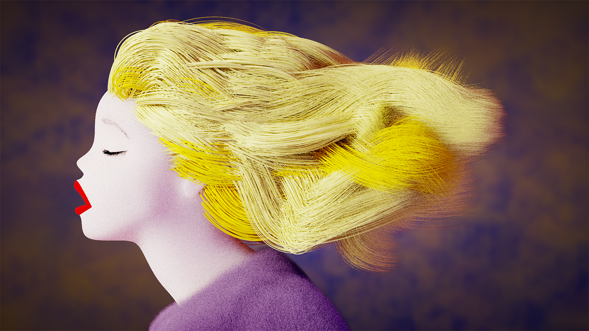
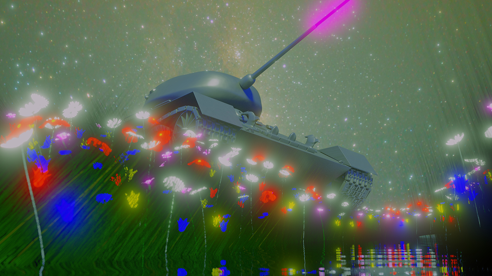
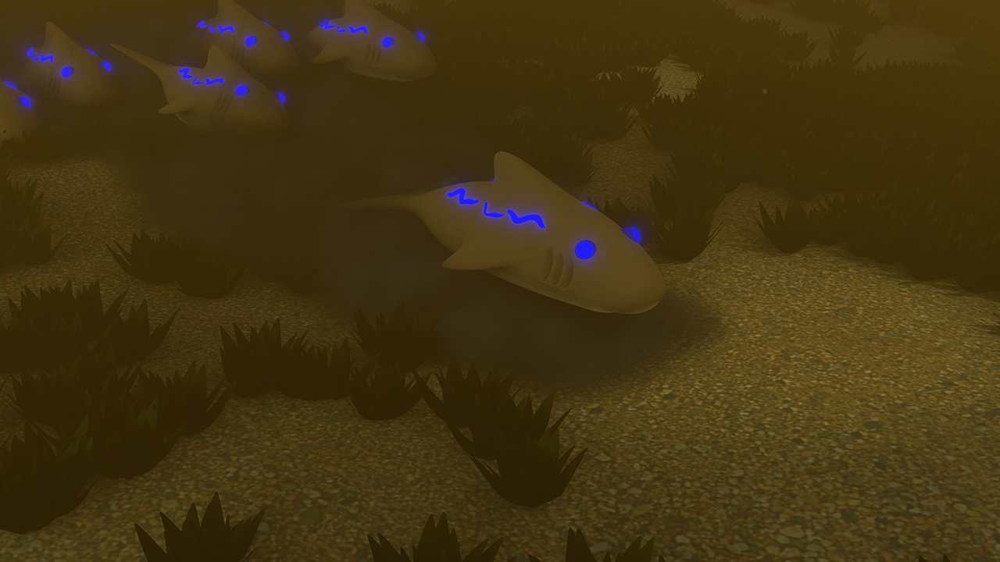
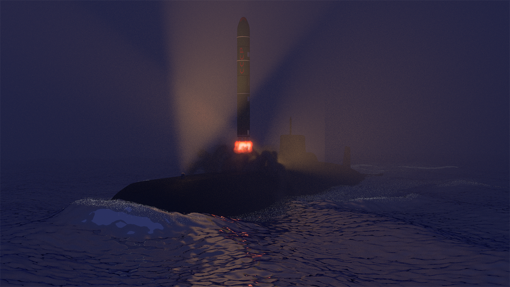
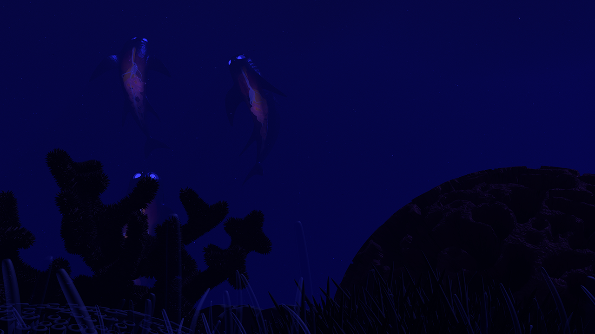
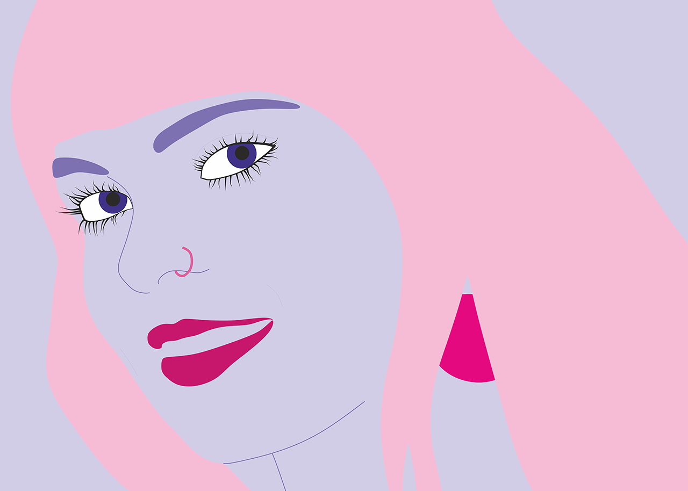
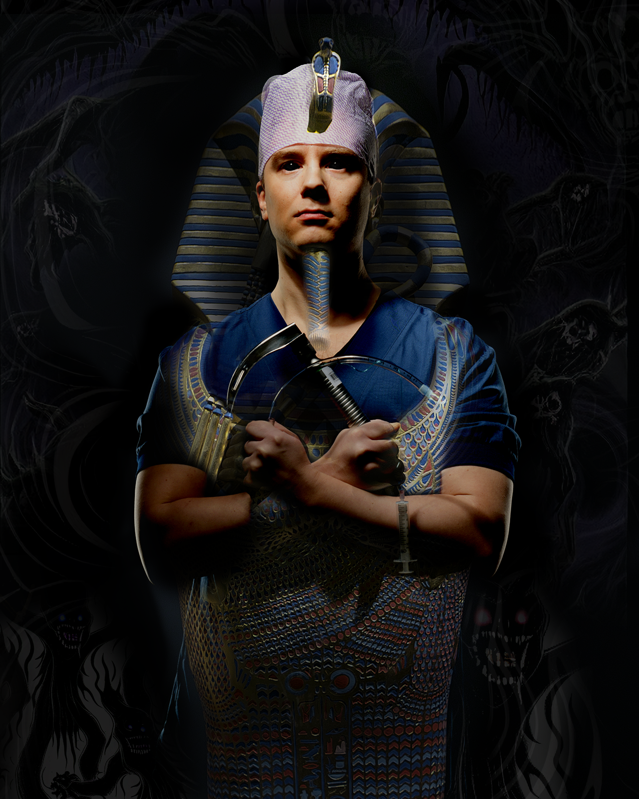
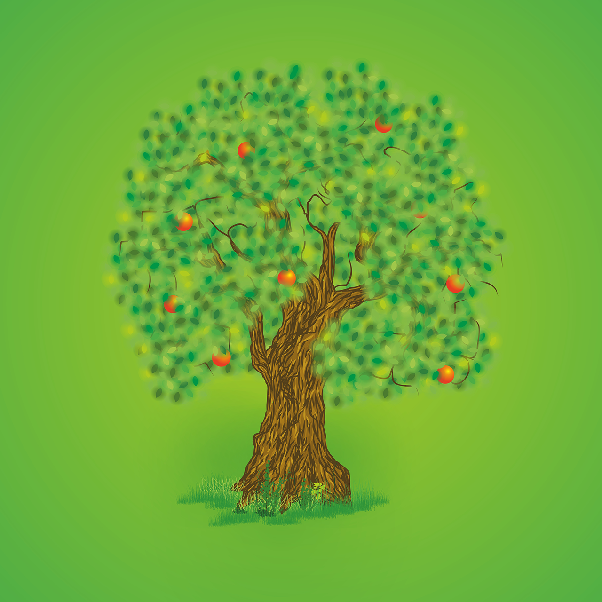
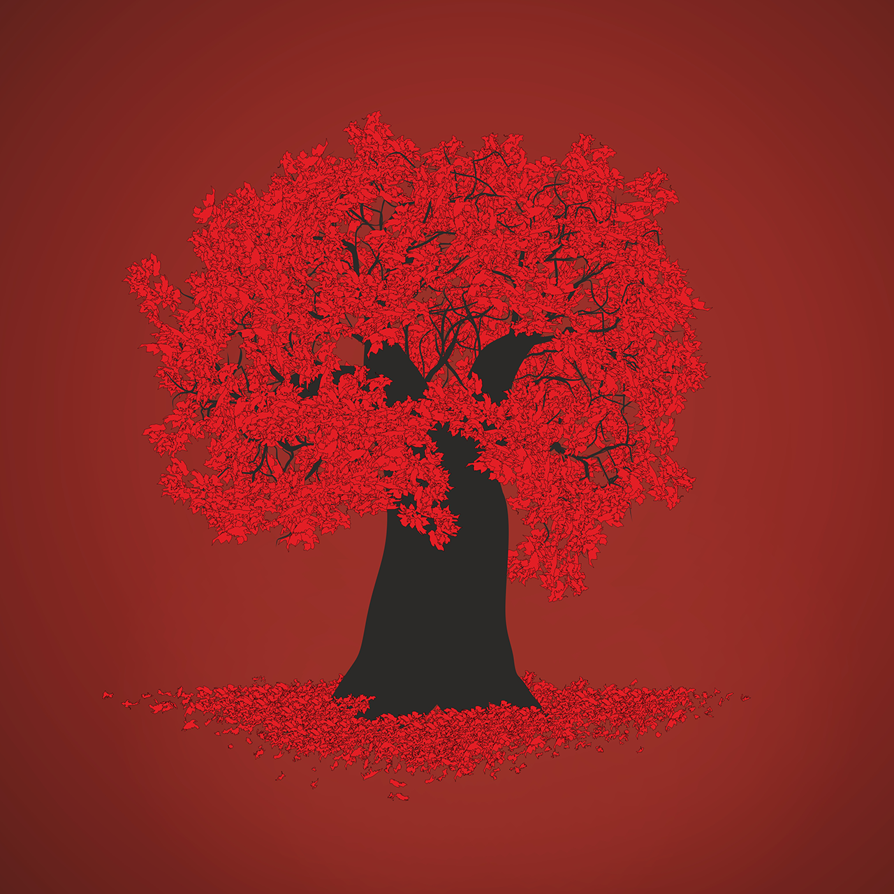
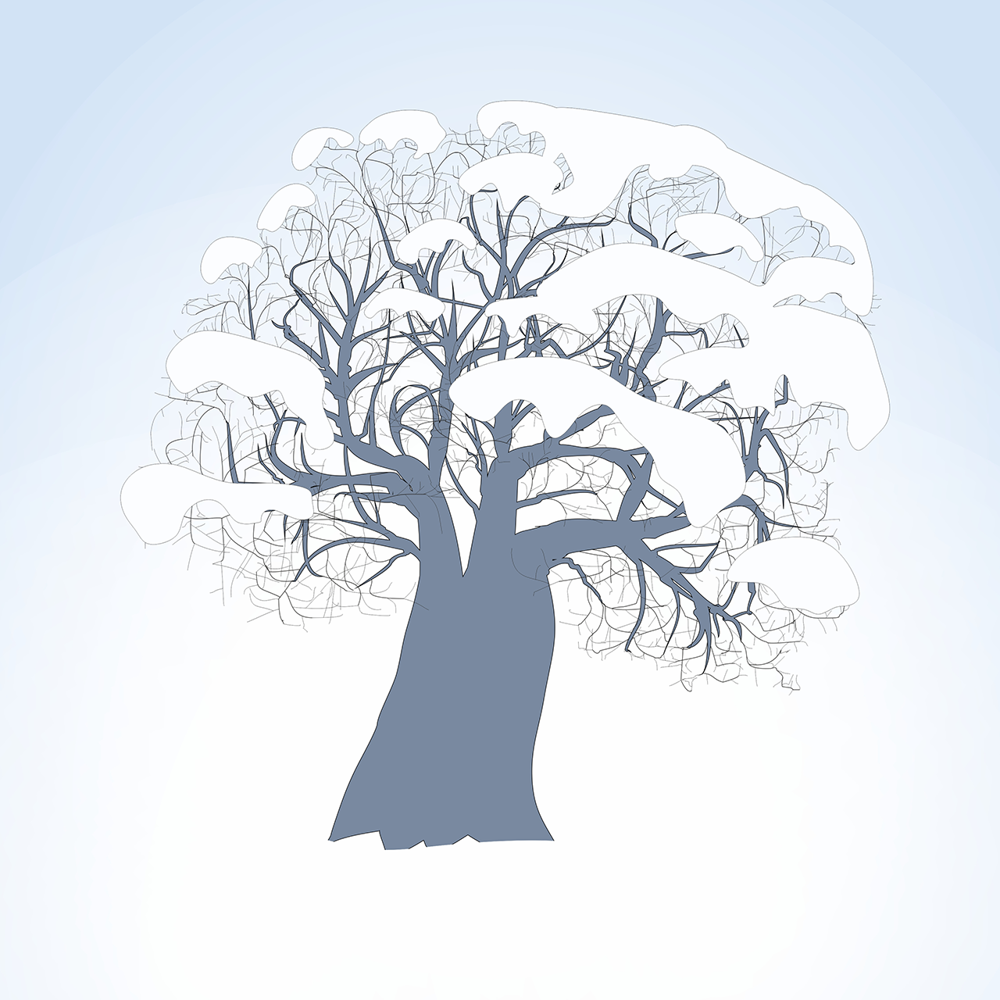

## Portfolio

Here are some of my art files from different times and technology stacks..

Blender, inspiration from Moebius "airtight garage" and engineer Barnier

<!-- 

Adobe Illustrator with background photo -->

Old Blender with composition effects

Blender

Blender

Blender

<!-- 

Illustrator from a photo -->

<!-- 

Photoshop with stable diffusion and matte -->

Photoshopt matte

Adobe llustrator

Adobe Illustrator

Adobe Illustrator

Adobe Illustrator

